<h1 align="center">
    KittyStager
</h1>

<p align="center">
  <a href="" rel="noopener">
 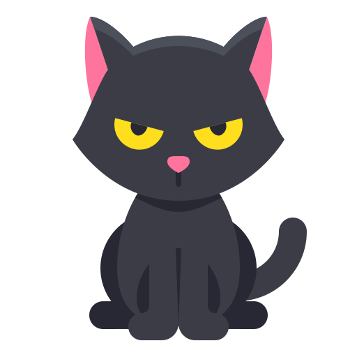 </a>
</p>


KittyStager is a stage 0 C2 comprising an API, client, and malware. The API is responsible for delivering basic tasks and shellcode to be injected into memory by the malware. The client also connects to the API and allows for interaction with the malware by creating tasks. The goal of KittyStager is to deploy a simple stage 0 payload onto the target system and gather enough information to adapt the payload to the specific target. As the stage 0 payload is intended to be as stealthy as possible, it does not include any command execution capabilities.

> **This project is made for educational purpose only. I am not responsible for any damage caused by this project.**


## Features
- A simple cli to interact with the implant
- API :
    - [x] A web server to host your kittens
    - [x] HTTPS
    - [x] Yours files in /upload are available on /upload
- Reconnaissance :
    - [x] Hostname, domain, pid, ip...
    - [x] AV or EDR solution with wmi
    - [x] Process list
- Encryption :
    - [x] Key exchange with Opaque
    - [x] Chacha20 encryption
- Malware capabilities :
    - [x] Create thread injection
    - [x] Bananaphone (Hell's gate variant)
    - [x] Halo's gate
    - [x] ETW patching
    - [x] Sleep with jitter
- Sandbox :
    - [x] Check ram
    - [x] Check a none existing website
- Payload :
    - [x] Raw shellcode
    - [x] Hex shellcode

> Some settings can be changed in the [config](config.yaml) file

## Quick start
### 1. Clone repository
```
git clone https://github.com/Enelg52/KittyStager.git
cd KittyStager 
```
### 2. Config file
Edit the config [file](config.yaml) :
- Check the IP/port
- HTTPS/HTTP
- Sleep time

#### HTTPS
How to generate certificate for https with openssl
```
$ openssl req  -new  -newkey rsa:2048  -nodes  -keyout localhost.key  -out localhost.csr
$ openssl  x509  -req  -days 365  -in localhost.csr  -signkey localhost.key  -out localhost.crt
```

### 3. build
Build the server :
```
cd server
go build
```
Build the client
```
cd client
go build
```
The server need to be running
```
cd kitten/basicKitten
env GOOS=windows GOARCH=amd64 go build -o basicKitten.exe
```
Then start the server, the client and run the kitten on the target.

## Usage
start server
```
 ./server -h
Usage of server:
  -p string
        Path to the config file (default "config.yaml")
```
The client will connect to `127.0.0.1:1337`. If your not on the server, you will need to use an ssh tunnel.
```
./client
```
### List kittens
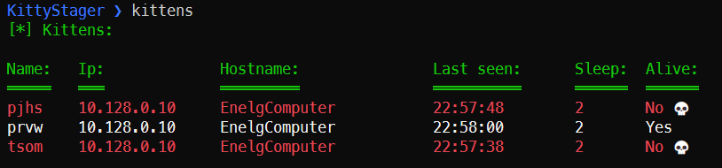
### Get logs
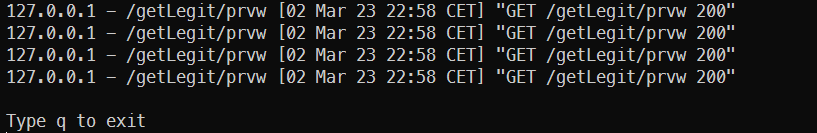
### Print config
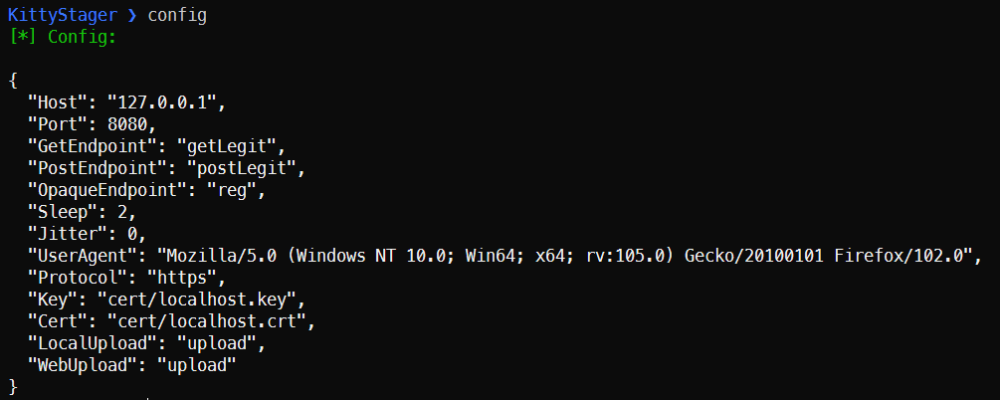
### Interact with a kitten
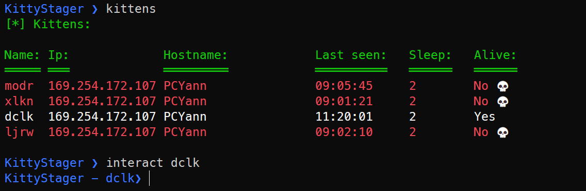
### Get tasks
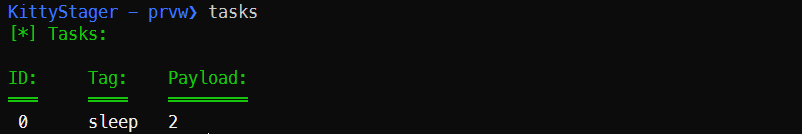
### Inject shellcode
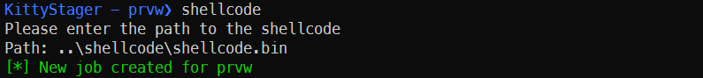
### Change sleep time
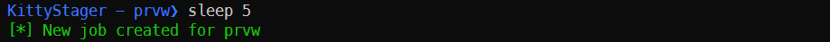
### Get process list
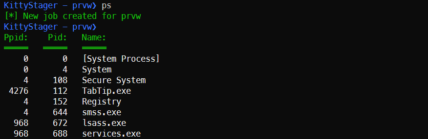
### Get AV/EDR with wmi
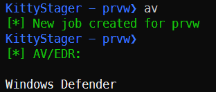
### Get privileges & integrity level
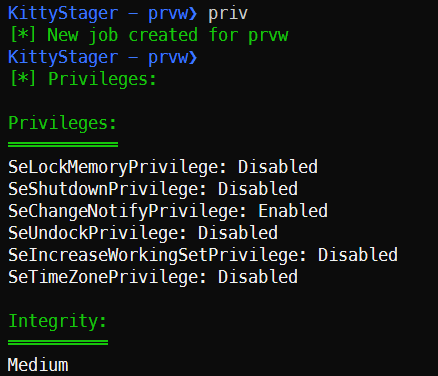
### Get kitten infos
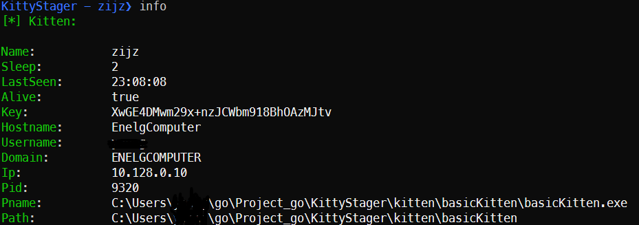
### Kill kitten
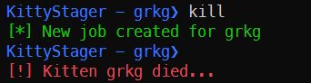

## Architecture
The projet is divided in 3 parts : 
- The [client](client)
- The [server](server)
- The [kitten](kitten)

The crypto part, kitten, config, tasks struct are in [internal](internal).  

## Contributing

Pull requests are welcome. Feel free to open an issue if you want to add other features.

## Contact
Enelg#9993 on discord

## Credits
- https://github.com/C-Sto/BananaPhone
- https://github.com/timwhitez/Doge-Gabh
- https://github.com/c-bata/go-prompt
- https://gist.github.com/leoloobeek/c726719d25d7e7953d4121bd93dd2ed3
- https://github.com/BishopFox/sliver/
- https://github.com/alinz/crypto.go/blob/main/chacha20.go
- https://github.com/frekui/opaque
- ... and many others