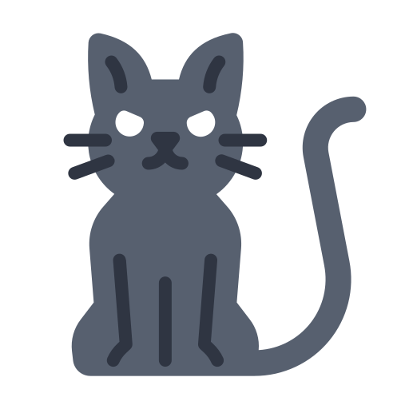
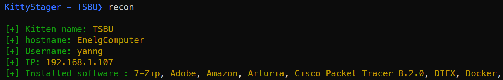

<h1 align="center">
    KittyStager
</h1>

<p align="center">
  <a href="" rel="noopener">
  </a>
</p>


KittyStager is a simple stage 0 C2. It is made of a web server to host the shellcode and an implant, called kitten.
The purpose of this project is to be able to have a web server and some implant for various usage and be 
able to use it with any shellcode.

This project is made for educational purpose only. I am not responsible for any damage caused by this project.

***I would not use this project in red team, at least not now.***


## Features
- A simple cli to interact with the implant
- Web server :
  - [x] A simple web server to host the shellcode
  - [x] User agent whitelist to prevent unwanted connections
- Reconnaissance :
    - [x] Hostname
    - [x] IP
    - [x] OS
    - [x] Domain
    - [x] And more...
- Encryption :
  - [x] Key exchange with Opaque
  - [x] Chacha20 encryption
- Malware capabilities :
  - [x] Standard injection
  - [x] Halo's gate
  - [x] Hell's gate
  - [x] Recycle gate
  - [x] ETW patching
- Sandbox :
  - [x] Check ram
  - [x] Check a none existing website
- Payload :
  - [x] Raw shellcode
  - [x] Hex shellcode
  - [x] Dll


## Installation
```
git clone https://github.com/Enelg52/KittyStager.git
cd KittyStager
go build -o KittyStager
```
### Build the implants
#### BasicKitten
```
cd /kittens/basicKitten
go build -o basicKitten.exe
```
#### BananaKitten
```
cd /kittens/bananaKitten
go build -o bananaKitten.exe
```
#### DllKitten
```
go build -buildmode=c-shared -o dllKitten.dll
```
### On linux
```
env GOOS=windows GOARCH=amd64 go build -o basicKitten.exe
```

## Usage

```
./KittyStager.exe -h
Usage of kittyStager.exe:
  -p string
        Path to the config file (default "cmd/config/conf.yml")
```
### DllKitten
```
runDll32.exe dllKitten.dll,DllMain
```

## Example
#### Implant check's in

#### Show target's information

#### Interact with the implant

#### Change sleep time

#### Inject shellcode or dll

#### Show recon


## Contributing

Pull requests are welcome. Feel free to open an issue if you want to add other features.

## Contact
Enelg#9993 on discord

## Credits
- https://github.com/C-Sto/BananaPhone
- https://github.com/timwhitez/Doge-Gabh
- https://github.com/c-bata/go-prompt
- https://gist.github.com/leoloobeek/c726719d25d7e7953d4121bd93dd2ed3
- https://github.com/BishopFox/sliver/
- https://github.com/alinz/crypto.go/blob/main/chacha20.go
- https://github.com/frekui/opaque
- ... and many others
